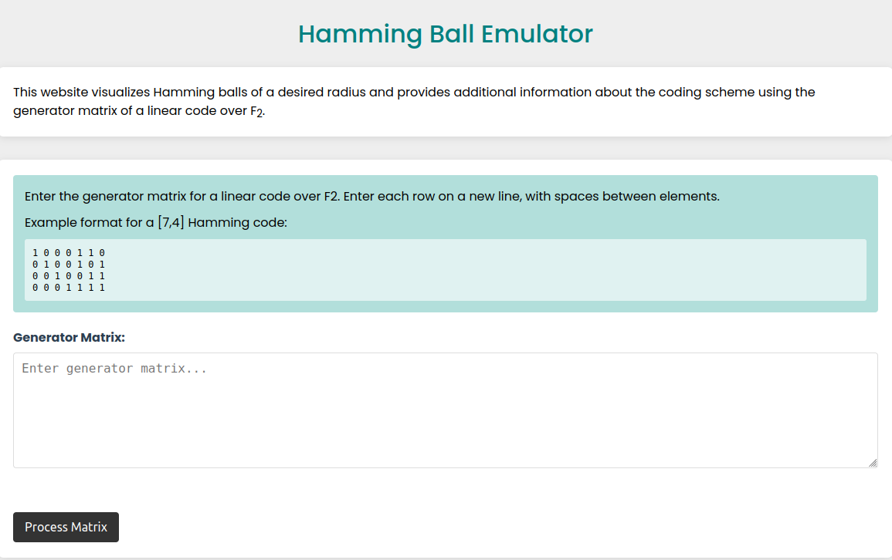
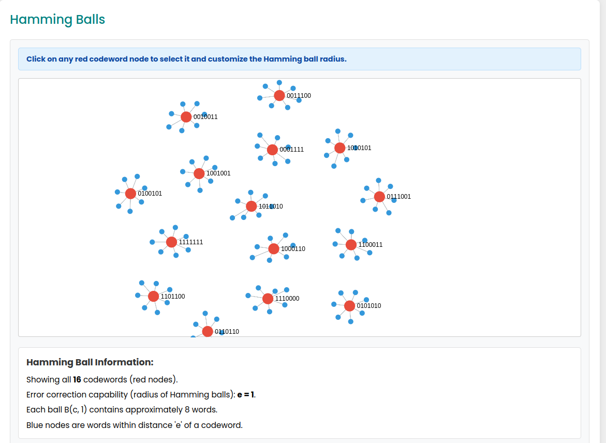
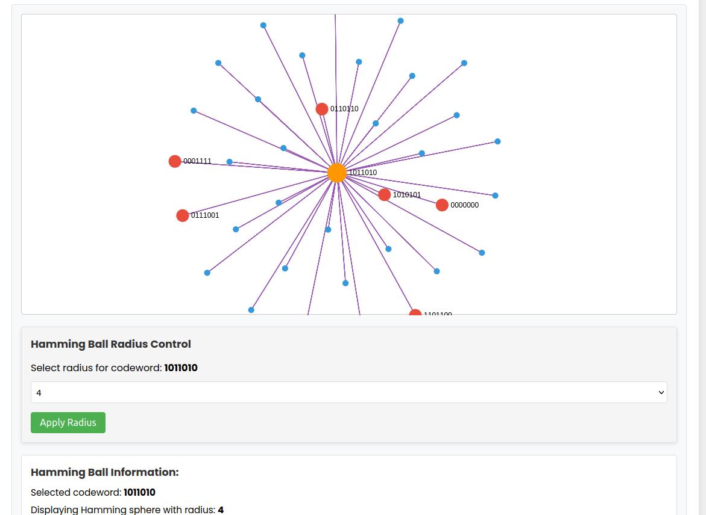

# 📘 Hamming Ball Emulator

This interactive web tool visualizes **Hamming balls** of a desired radius based on a generator matrix over **F₂**. It was developed as part of the **CS425 - Coding Theory** course project.



---

## 🔍 Overview

The **Hamming Ball Emulator** helps users:

- Input a generator matrix for a linear code over F₂.
- Visualize the corresponding codewords.
- See Hamming balls of radius *e* centered around each codeword.
- Explore the code's error correction capability in an intuitive graphical format.

---

## 💡 Features

- 🧮 Accepts a generator matrix as input.
- 🎯 Plots all valid codewords in red.
- 🟦 Displays Hamming balls of specified radius (blue neighbors).
- 🔧 Allows dynamic radius adjustment for selected codewords.
- 📊 Provides textual information about the code and error correction.

---

## 📸 Screenshots

### 1. Matrix Input Interface

Users can input a generator matrix for a linear code over **F₂**.


---

### 2. Hamming Ball Visualization

Each red node represents a codeword. Blue nodes are binary strings within distance *e* from a codeword.



---

### 3. Interactive Radius Selection

Click a red node (codeword) to display its Hamming ball with a custom radius.



---

## 🚀 Getting Started

### 1. Clone the Repository

```bash
git clone https://github.com/Mithun-2004/HammingBallEmulator.git
cd HammingBallEmulator
```

### 2. Run the App

Simply open `index.html` in any modern web browser.

_No dependencies or build tools required._

---

## 🛠 Tech Stack

- HTML
- CSS
- JavaScript
- sigma.js (for dynamic graph visualization)

---

## 📚 Example Generator Matrix

```
1 0 0 0 1 1 0
0 1 0 0 1 0 1
0 0 1 0 0 1 1
0 0 0 1 1 1 1
```

---

## 📎 Folder Structure

```
.
├── TheHammingBallEmulator.pdf
├── index.html
├── style.css
├── script.js
├── screenshots/
│   ├── screenshot1.png
│   ├── screenshot2.png
│   └── screenshot3.png
```

---

## 👥 Authors

This project was built as part of **CS425 - Coding Theory** coursework.

> **Contributors:** *Mithun P and Utsav Shah*

---

## 📄 License

This project is licensed under the MIT License.
